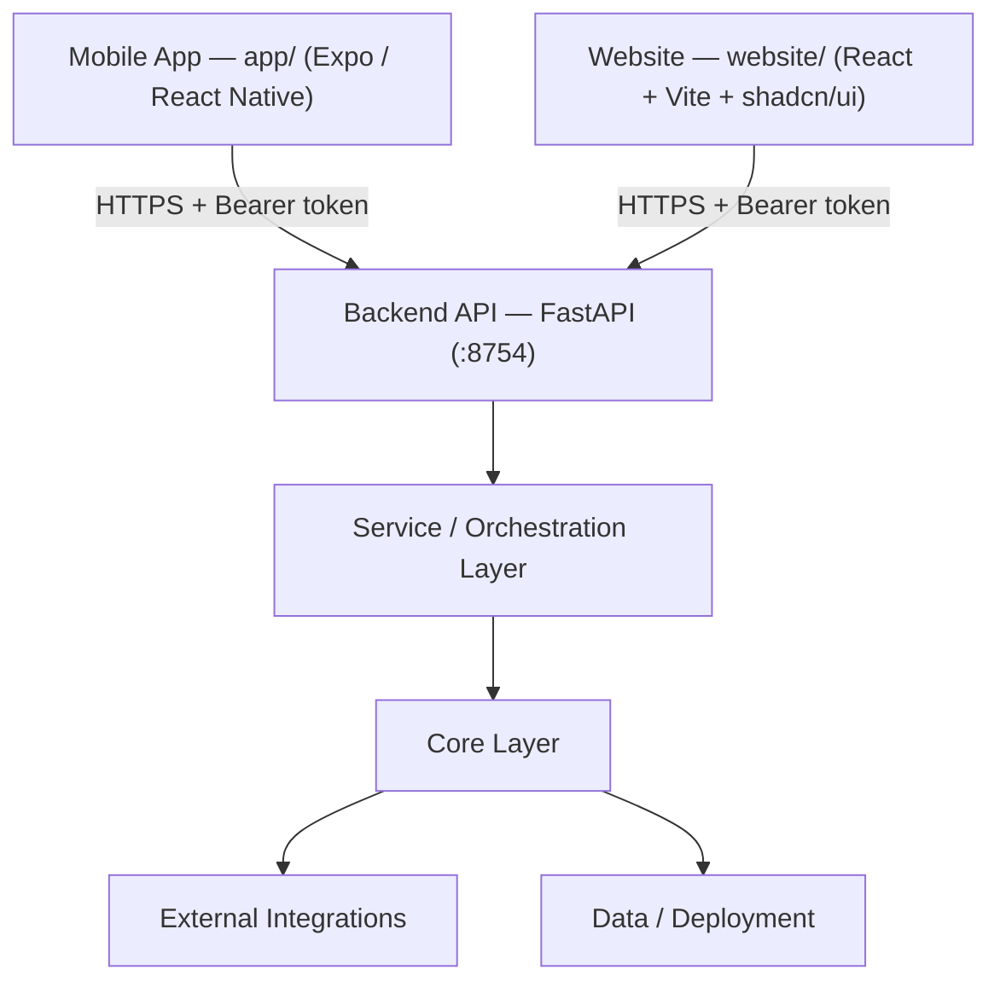

# Sentinel-AI Architecture

Sentinel-AI is an automated video incident-detection platform: one FastAPI backend analyzes footage (motion → YOLO → vision LLM → escalation → optional emergency dispatch) and serves everything to its clients.<br>
Two clients — the Expo mobile app and the React website — both talk to that same backend API.

## Architecture diagram



> Visual overview of the platform (Mermaid — rendered automatically on GitHub). The sections below describe every block in the diagram, and the code block under **High-level view** is a full plain-text breakdown of the same components.

## High-level view

Sentinel-AI has **two independent clients** — the web application and the mobile application — that both talk to **one backend API**. The API runs the detection pipeline (motion → YOLO → vision LLM), a verification agent, optional emergency dispatch, and an incident log. Both clients authenticate the same way (`POST /login` with a CNIC) and consume the same endpoints.

```
CLIENTS
  +----------------------------------------+      +----------------------------------------+
  | MOBILE APP - Expo (React Native)       |      | WEBSITE - React + Vite + shadcn/ui     |
  | app/                                   |      | website/                               |
  |                                        |      |                                        |
  | - English / Urdu UI (RTL)              |      | - Marketing site: /, /how-it-works,    |
  | - CNIC login decides the role:         |      |   /use-cases, /tech-stack, /dashboard, |
  |     user -> record / upload            |      |   /detection-capabilities, /privacy-   |
  |     authoritative -> admin feed        |      |   policy                               |
  | - Record live footage in 5s chunks     |      | - /demo uploads a clip to exercise the |
  |   (GPS + camera_id, single_upload=0)   |      |   real pipeline (auto-login via        |
  | - Upload Video = DEMO ONLY             |      |   VITE_DEMO_CNIC, single_upload=1)     |
  | - Admin feed polls /incidents/latest,  |      | - Plays the generated voice alert      |
  |   plays alert audio, marks processed   |      |   (GET /audio/{file})                  |
  |                                        |      | - Sample-response fallback when the    |
  |                                        |      |   API is offline                       |
  +-------------------+--------------------+      +-------------------+--------------------+
                      |                                               |
                      +-----------------------------------------------+
                                              |
                                              v
  +----------------------------------------------------------------------------------------+
  | BACKEND API - FastAPI  (python main.py | serves :8754)                                 |
  |                                                                                        |
  | main.py: app wiring - CORS (CORS_ORIGINS), per-IP rate limiter,                        |
  | upload-size and security-headers middleware, GET /health                               |
  |                                                                                        |
  | api/routes.py - the endpoints both clients call:                                       |
  |   POST /login             CNIC (Argon2id hash) -> bearer token + user_type             |
  |   POST /analyze-video     MP4/AVI/MOV clip -> incident analysis                        |
  |   GET  /audio/{filename}  generated voice alert (auth required)                        |
  |   GET  /incidents/latest  open incidents (status 'new'), newest first                  |
  |   POST /incidents/{id}/pass   mark an incident handled                                 |
  |                                                                                        |
  | Request gates: extension + magic bytes, size <= MAX_UPLOAD_MB, duration                |
  | <= MAX_VIDEO_SECONDS. A per-source queue (camera_id or client IP)                      |
  | serializes clips so one camera never overlaps itself.                                  |
  +----------------------------------------------------------------------------------------+
                                              |
                                              v
  +----------------------------------------------------------------------------------------+
  | SERVICE / ORCHESTRATION LAYER                                                          |
  |                                                                                        |
  | services/video_service.analyze_video(path, languages, location,                        |
  | camera_id, single_upload) - runs the pipeline, then feeds the outcome                  |
  | to the agent when escalation reaches ALERT                                             |
  |                                                                                        |
  | services/process_video.process_video_for_incidents() - OpenCV loop:                    |
  |   motion scoring (absdiff -> blur -> adaptive threshold over a short                   |
  |   frame history) -> YOLO detect_objects (core/yolo_helpers, stock COCO                 |
  |   model, confidence + interest-class gate) -> core/escalation state                    |
  |   machine per camera: IDLE -> SUSPICIOUS -> CONFIRMING -> ALERT ->                     |
  |   COOLDOWN (vision LLM runs only on SUSPICIOUS -> CONFIRMING; repeated                 |
  |   CONFIRMING hits authorize dispatch; COOLDOWN throttles re-alerts)                    |
  |                                                                                        |
  | services/geocode.reverse_geocode(lat, lon) - coordinates -> readable                   |
  | place via the external reverse-geocoding API (REVERSE_GEOCODE_URL)                     |
  |                                                                                        |
  | services/incident_store.py - incidents.json records {id, created_at,                   |
  | status, display_name, llm_desc, agent_answer, audio_file}; status                      |
  | 'new' -> 'false' after POST /incidents/{id}/pass                                       |
  +----------------------------------------------------------------------------------------+
                                              |
                                              v
  +----------------------------------------------------------------------------------------+
  | CORE LAYER (shared intelligence)                                                       |
  |                                                                                        |
  | core/config.py     dotenv config + SYSTEM_PROMPT (verify, then force the tool call)    |
  | core/security.py   Argon2id CNIC hashes, hashed sessions with TTL, rate-limit,         |
  |                    upload-size and security-header middleware                          |
  | core/llm.py        Gemini 3.5 Flash Lite (primary) with a Groq qwen3.8-27b fallback    |
  | core/agent.py      LangChain agent (runs only on ALERT)                                |
  | core/tools.py      call_ambulance(1122) / call_police(15) / call_firebrigade(16):      |
  |                    SIP trunk via Asterisk AMI Originate + TTS voice message            |
  |                    (ElevenLabs or edge-tts); language-aware (Urdu if 'ur'); tool       |
  |                    failures stay internal -> outcome shown in the API dispatch[]       |
  | core/escalation.py  per-camera state-machine registry (thread-safe, lazy decay)        |
  | core/yolo_helpers.py YOLO wrapper (detect_objects -> bboxes + confidence)              |
  +-------------------+-----------------------------------------------+--------------------+
                      |                                               |
  +-------------------+--------------------+      +-------------------+--------------------+
  | EXTERNAL INTEGRATIONS                  |      | DATA / DEPLOYMENT                      |
  |                                        |      |                                        |
  | - Gemini / Groq chat APIs              |      | - .env: LLM keys + CNIC hashes,        |
  |   (LLM + vision)                       |      |   limits, escalation + queue tuning    |
  | - Reverse geocoder (Nominatim default) |      | - incidents.json + generated_audio/    |
  | - Asterisk AMI over the SIP trunk      |      |   (alert-*.wav) - pruned periodically  |
  | - TTS: ElevenLabs or edge-tts (no key, |      | - YOLO weights yolo11m.pt (stock COCO) |
  |   Urdu voice ur-PK-UzmaNeural)         |      | - Docker: python:3.12-slim, port :8754 |
  |                                        |      | - website/ -> Vercel (SPA rewrites)    |
  |                                        |      | - app/ -> Expo Go / dev build          |
  +----------------------------------------+      +----------------------------------------+
```

### Detection gating inside one clip

```
frame
  |
  v
motion detected? -----------no-----------> discard (debug log)
  | yes
  v
YOLO on the frame -> interest class >= YOLO_CONF_THRESHOLD? ---no---> discard (debug log)
  | yes    (gated detection feeds the per-camera escalation state machine)
  v
SUSPICIOUS -> CONFIRMING      (vision LLM describes the frame once)
  | repeated gated detections while CONFIRMING
  v
ALERT -> agent runs -> dispatch tools call 1122 / 15 / 16 over the SIP trunk
  v
COOLDOWN                      (re-alerts throttled per camera)
```

## How the two clients differ

| Concern | 🌐 Website (`website/`) | 📱 Mobile App (`app/`) |
|---|---|---|
| Platform | Browser (React 18 + Vite + Tailwind + shadcn/ui) | Android/iOS via Expo Go (React Native) |
| Main job | Marketing site **plus** a `/demo` page that uploads a clip to the real backend | Field app: **record live footage** in 5 s chunks and stream each chunk to the backend, or upload a clip |
| CNIC login | Auto-login with `VITE_DEMO_CNIC` for the demo | Manual CNIC login; role decides the UI (`user` vs `authoritative`/admin) |
| `single_upload` | Always `1` (one-off demo clip → fresh tracker; alert once `ESCALATION_CONFIRMING_HITS` gated detections confirm) | `0` when recording chunks (state machine persists via `camera_id`), `1` for the demo upload screen |
| Video source | File picked in the browser | `expo-camera` live recording or gallery file |
| Extra metadata | Fixed demo `latitude`/`longitude`/`camera_id` | Real GPS (`expo-location`) + user-configurable `camera_id` |
| Other endpoints | `GET /audio/{file}` (plays the voice alert) | `GET /audio/{file}`, `GET /incidents/latest`, `POST /incidents/{id}/pass` (admin feed), `GET /health` (connection check) |
| Backend URL config | `VITE_API_URL` (`.env` / Vercel) | `EXPO_PUBLIC_API_URL` (`.env`), overridable in the in-app Settings screen |

> ⚠️ **Demo-only uploads:** the website `/demo` page and the mobile app's **Upload Video** screen send a *pre-recorded file* to `POST /analyze-video` purely to demonstrate the detection pipeline. In a real deployment the same API is fed by **live video** — the mobile app's Record mode already behaves like this by uploading continuous 5-second chunks, and stationary cameras would stream (or push short clips with a stable `camera_id`) the same way.

> 💡 **Demo settings disclaimer** — the mobile app's Settings screen exposes backend URL,
> camera ID, polling interval, and other options so you can experiment during development.
> In a production deployment these settings would be removed from the UI (fixed at build
> time or provisioned remotely) or automated entirely.

> 🔍 **Production logging** — in development the API uses Python's built-in `logging`
> module with stdout output. For a production deployment, integrate **Pydantic Logfire**
> (structured observability for the FastAPI pipeline, LLM calls, and YOLO gates) and
> **LangSmith** (tracing and evaluation of LangChain agent runs and tool calls) to
> monitor, debug, and audit the full detection-to-dispatch flow.

> 📍 **Responder GPS navigation** — the current app sends optional GPS coordinates with
> every upload, and the API reverse-geocodes them into a readable place used in the
> analysis and voice alert. In a production deployment, a full in-app navigation feature
> would be added so responders can see the exact incident location on a map and get
> turn-by-turn directions directly in the app, using the reported coordinates as the
> destination.

> 🗄️ **Production CNIC store** — in development, authorized CNIC hashes are stored in `.env`
> (`AUTHORIZED_CNICS` / `NORMAL_USER_CNIC`). In a production deployment these would be
> replaced with a database-backed user store (e.g. PostgreSQL), with CNICs registered
> through a secure admin interface and hashed with Argon2id on write — the lookup logic
> stays the same.

## Request lifecycle (`POST /analyze-video`)

1. Client calls `POST /login` with a CNIC and receives a bearer token (`user_type` tells the client which UI to show).
2. Client uploads a video (`multipart/form-data`) with `Authorization: Bearer <token>` plus optional `language`, `latitude`/`longitude`, `camera_id`, `single_upload`.
3. `api/routes.py` validates extension + magic bytes, size and duration, then queues the clip per source (`camera_id` or client IP) so clips from one camera never overlap.
4. `services/video_service` → `services/process_video` runs the frame loop: motion gate → YOLO gate → escalation state machine → vision LLM (only on the SUSPICIOUS → CONFIRMING transition, capped by `MAX_FRAMES_TO_ANALYZE`).
5. Coordinates are reverse-geocoded (`services/geocode`) into a readable place used in the analysis and the spoken alert.
6. On ALERT, the LangChain agent (`core/agent`) verifies the incident and is forced to call one or more dispatch tools (`core/tools`); the tool places a real SIP call through Asterisk AMI and a TTS voice message is generated (ElevenLabs or edge-tts).
7. The API returns `{filename, camera_id, location, escalation, incidents_detected, video_analysis, agent_response, dispatch[], audio_file}` and appends a compact record to `incidents.json` when incidents were found.
8. Authoritative clients poll `GET /incidents/latest` (or fetch right after an upload) and can play the alert with `GET /audio/{file}`; `POST /incidents/{id}/pass` marks an incident handled.

## See also

- [README.md](README.md) — how to run the API, the website and the app
